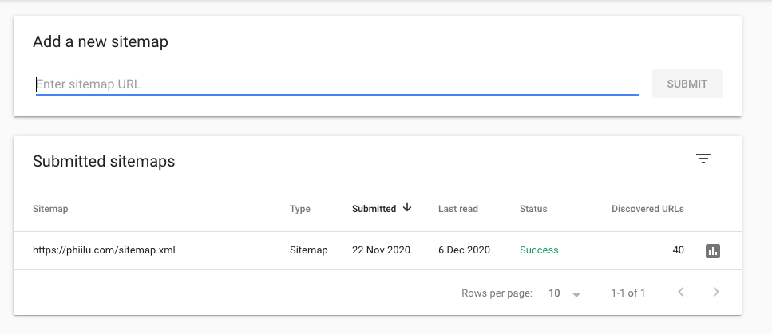

One way to improve your SEO is by submitting a sitemap to Google. Sitemaps are an XML representation of your website and its pages. It allows search engines to know what pages your website has, without crawling each link on your page first.

By submitting a sitemap to the [Google Search Console][1] you can help Google to better identify your pages and you can see problems if some of the URLs are not being indexed.

Most websites have sitemaps and you can easily find them by looking at the `robots.txt` and searching for the `Sitemap` entry.

Here are a few sitemaps by popular websites:

- Google: [https://www.google.com/sitemap.xml][2]
- The Verge: [https://www.theverge.com/sitemaps][3]
- NY Times: [https://www.nytimes.com/sitemaps/new/news.xml.gz][4]

## Generating the sitemap.xml

With a CMS like WordPress, you usually get a sitemap generated by default, but if you created your site using Next.js you need to take care of this yourself.

Gladly this is not a too hard problem to solve and you probably can just copy my code with some adjustments and you should be fine.

As in my post where I described [how to generate an RSS feed][5] with Next.js, I will create a new file inside my `lib` folder and name it `sitemap.js`.

Here is the content of my `sitemap.js`:

```javascript
const globby = require('globby');
const contentful = require('./contentful').default;
const { SitemapStream, streamToPromise } = require('sitemap');
const { Readable } = require('stream');
const fs = require('fs');

// pages that should not be in the sitemap
const blocklist = ['/newsletter-success', '/404'];

async function generateSitemap() {
  if (process.env.NODE_ENV === 'development') {
    return;
  }

  const baseUrl = process.env.BASE_URL;
  const pages = await globby([
    'src/pages/**/*{.js,.mdx}',
    '!src/pages/**/[*',
    '!src/pages/_*.js',
    '!src/pages/api'
  ]);

  // normal page routes
  const pageLinks = pages
    .map((page) => {
      const path = page
        .replace('pages', '')
        .replace('.js', '')
        .replace('.mdx', '')
        .replace('src/', '');
      return path === '/index'
        ? { url: '/', changefreq: 'daily', priority: 0.7 }
        : { url: path, changefreq: 'daily', priority: 0.7 };
    })
    .filter((page) => !blocklist.includes(page.url));

  // post routes
  const posts = await contentful.getEntries('post', {
    order: '-fields.publishedDate'
  });
  const postLinks = posts.map((post) => ({
    url: `/${post.slug}`,
    changefreq: 'daily',
    priority: 0.7
  }));

  // tag routes
  const tags = await contentful.getEntries('tag');
  const tagLinks = tags.map((tag) => ({
    url: `/tag/${tag.slug}`,
    changefreq: 'daily',
    priority: 0.7
  }));

  const links = [...pageLinks, ...postLinks, ...tagLinks];
  const stream = new SitemapStream({ hostname: baseUrl });

  const xml = await streamToPromise(Readable.from(links).pipe(stream)).then((data) =>
    data.toString()
  );

  fs.writeFileSync('./public/sitemap.xml', xml);
}

export default generateSitemap;
```

I am using two external dependencies in this code, [globby][6] and [sitemap][7], so you have to add them to your `package.json`.

```bash
yarn add -D globby sitemap
```

Let's breakdown the code into smaller pieces and let me explain what we are doing here.

---

```javascript
// if (process.env.NODE_ENV === 'development') {
//   return;
// }

const baseUrl = process.env.BASE_URL;
const pages = await globby([
  'src/pages/**/*{.js,.mdx}',
  '!src/pages/**/[*',
  '!src/pages/_*.js',
  '!src/pages/api'
]);
```

First of all, we don't want to run this script when we are in development mode. For now, it is commented, because we need to test our function first, but after it is working you can uncomment it and it will only run in production.

Next, I defined some variables. `baseUrl` will be your domain of the website like in my case the value will be `https://phiilu.com`.

I am using a package named `globby` to get all the pages from the `pages` folder using a [glob][8]. It will return all the pages that are either `.js` or `.mdx` and not starting with `[` or `_` like you would use for dynamic pages or the `_app.js`. It won't return the files that are in the `pages/api` folder too.

---

```javascript
const blocklist = ['/newsletter-success', '/404'];

// normal page routes
const pageLinks = pages
  .map((page) => {
    const path = page
      .replace('pages', '')
      .replace('.js', '')
      .replace('.mdx', '')
      .replace('src/', '');
    return path === '/index'
      ? { url: '/', changefreq: 'daily', priority: 0.7 }
      : { url: path, changefreq: 'daily', priority: 0.7 };
  })
  .filter((page) => !blocklist.includes(page.url));
```

Here I am creating an array of `pageLinks` that will be used to generate the sitemap. We only want to have the name of the file, so we are replacing the strings we won't need with an empty string. You can adjust the values for `changefreq` or `priority` for your needs. Those values will tell the search engine how often the page is changing and how important it is.

I also have some pages that I don't want to have inside the `sitemap.xml`, so I created a `blocklist` array and filter the pages that are in that array.

---

```javascript
// post routes
const posts = await contentful.getEntries('post', {
  order: '-fields.publishedDate'
});
const postLinks = posts.map((post) => ({
  url: `/${post.slug}`,
  changefreq: 'daily',
  priority: 0.7
}));

// tag routes
const tags = await contentful.getEntries('tag');
const tagLinks = tags.map((tag) => ({
  url: `/tag/${tag.slug}`,
  changefreq: 'daily',
  priority: 0.7
}));
```

This part may not be necessary for you, depending on if you are using a headless CMS or not. I am using Contentful to store my posts and tags so I will have to fetch the data from there and create the `postLinks` and `tagLinks` array which will have the same structure as the `pageLinks` array.

---

```javascript
const links = [...pageLinks, ...postLinks, ...tagLinks];
const stream = new SitemapStream({ hostname: baseUrl });
const xml = await streamToPromise(Readable.from(links).pipe(stream)).then((data) =>
  data.toString()
);
fs.writeFileSync('./public/sitemap.xml', xml);
```

Last but not least, I created the final `links` array which will contain all links that I want to have inside my `sitemap.xml`. To generate the `sitemap.xml` I am using a package named `sitemap` that will be doing the hard work of generating the correct XML content. Finally, the XML data will be saved to a file inside the `public` folder, so Next.js can serve it.

## Generate the sitemap during the build

I will be using the same approach as with generating the RSS feeds. Importing the `generateSitemap` function in the pages/index.js file and adding it to the getStaticProps will make sure Next.js will call this function during the build of the `pages/index.js` page and generate the sitemap.

```javascript
export async function getStaticProps() {
  // ...
  await generateRssFeed();
  await generateSitemap();
  return {
    props: { posts, ogImage, baseUrl }
  };
}
```

## Submit the sitemap to Google

Finally, now that you have your `sitemap.xml` file, you can submit this file to the [Google Search Console][1]. After adding your domain to the Search Console you just have to go to the Sitemap page and submit the URL where your `sitemap.xml` file is available. After a few days, you will see how many pages of your sitemap are being indexed by Google and which ones will have some problems.



## Conclusion

Generating a sitemap can be very useful for search engines and having one can only be a benefit. If you are using Next.js you need to take care of this yourself, but as I have shown you in this tutorial it is not very difficult as the hard part will be done by existing packages anyway.

[1]: http://search.google.com/search-console
[2]: https://www.google.com/sitemap.xml
[3]: https://www.theverge.com/sitemaps
[4]: https://www.nytimes.com/sitemaps/new/news.xml.gz
[5]: https://phiilu.com/generate-rss-feeds-for-your-static-next-js-blog
[6]: https://github.com/sindresorhus/globby
[7]: https://github.com/ekalinin/sitemap.js
[8]: https://en.wikipedia.org/wiki/Glob_%28programming%29
